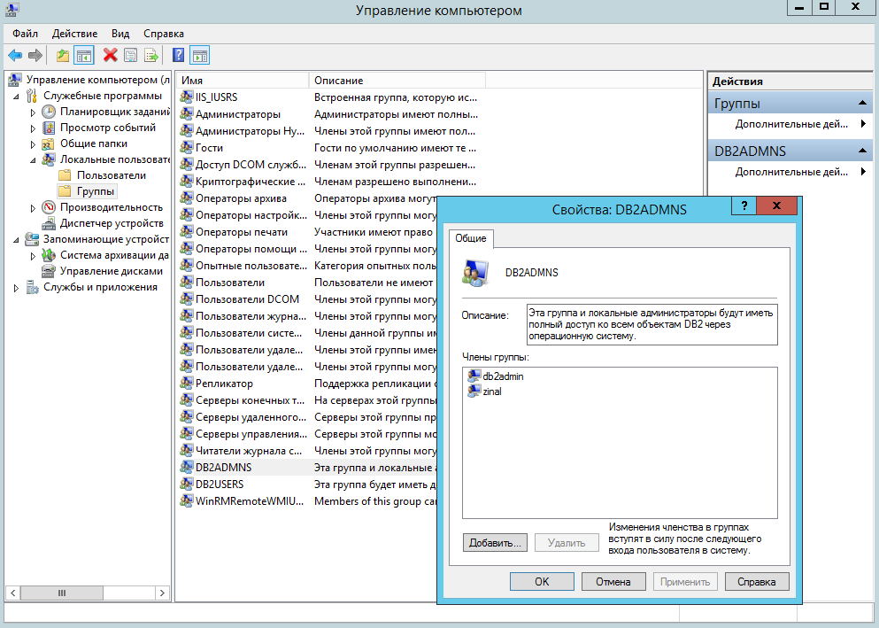

# Установка и первичная настройка Db2 для IBM Optim

Ниже описан порядок действий по установке и первоначальной настройке
программного обеспечения IBM Db2 для использования в системах
маскирования данных на базе IBM Optim.

Пример операций установки приведён для операционной системы
Microsoft Windows. Установка на другие операционные системы
отличается в основном составом предварительных подготовительных
работ (т.е. установкой требуемых пакетов и, в некоторых
случаях, настройкой системных параметров).

Выполняется:
1. Установка программного обеспечения Db2.
2. Создание экземпляра Db2.
3. Создание БД репозитория Optim.

Необходимые файлы дистрибутивов:
* `v11.1.4fp6_ntx64_universal_fixpack.exe` - "универсальный" пакет
  обновления Db2 11.1 Fix Pack 6, обеспечивающий обновление и
  первоначальную установку серверных и клиентских компонентов Db2;
* `DB2_ESE_Restricted_Activation_11.1.zip` - лицензионный ключ для
  использования Db2 11.1 в составе Optim и/или Information Server.

---

Для установки программного обеспечения Db2 необходимо:
1. распаковать основной архив с дистрибутивом (с помощью утилиты 7zip,
   либо запуском самораспаковывающегося архива);
1. запустить программу `UNIVERSAL\setup.exe` с правами администратора
   локального сервера;
1. выбрать в диалоговом окне пункт "Установить продукт" ("Install
   product");
1. нажать кнопку "Установить новую копию" ("Install new copy")
   в разделе "Db2 Server Editions";
1. следовать инструкциям мастера по установке, все выбираемые опции
   можно оставлять в значении по умолчанию, за исключением:
    * вместо предлагаемого каталога установки `C:\Program Files\IBM\SQLLIB\`
      указать `C:\IBM\SQLLIB\`, либо каталог на другом диске с достаточным
      объёмом свободного пространства;
    * отключить опцию автоматического запуска SSH-сервера
      при старте операционной системы;
    * ввести и подтвердить пароль создаваемого или существующего
      пользователя `db2admin`, соответствующий требованиям парольной
      политики организации;
    * выключить опцию отправки уведомлений на email.

В результате работы программы установки:
* устанавливается программное обеспечение сервера и клиента Db2 в
  указанный каталог;
* создаются локальные группы пользователей `DB2ADMNS` и `DB2USERS`, в
  которые необходимо включить учётные записи администраторов и
  пользователей Db2, соответственно;
* создаётся учётная запись `db2admin`, от имени которой запускаются
  службы (системные сервисы) Db2;
* создаётся экземпляр Db2, который по умолчанию настраивается
  для доступа через сетевой порт 50000.

---

После завершения установки Db2 следует выполнить следующие операции:
1. включить пользователя, от имени которого выполняется установка,
   в группу `DB2ADMNS`;
1. заново войти в систему (обеспечив обновление действующих прав
   доступа);
1. запустить из стартового меню программу "Командное окно DB2 - Администратор";
1. установить в открывшемся консольном окне шрифт "Consolas" для
   обеспечения корректного отображения кириллических символов;
1. распаковать архив с лицензионным ключом в любой удобный каталог;
1. применить лицензионный ключ, выполнив команду следующего вида:<br/>
   `db2licm -a C:\Ditto\ese_o\db2\license\db2ese_o.lic`
1. убедиться в успешном применении лицензионного ключа, выполнив
   команду `db2licm -l` (см. пример вывода ниже);
1. выполнить следующую команду: `db2set DB2_FMP_COMM_HEAPSZ=131072`,
   а затем выполнить перезапуск экземпляра Db2 командами `db2stop`
   и `db2start`;
1. создать базу данных репозитория Optim, выполнив следующую команду:<br/>
   `db2 create database optimdir pagesize 32 k`

На снимке экрана ниже показан пример включения пользователя `zinal`,
от имени которого выполняются действия по установке, в группу
пользователей `DB2ADMNS`:



Пример вывода информации о лицензировании:
```
C:\IBM\SQLLIB\BIN>db2licm -l
Имя продукта:                     "DB2 Enterprise Server Edition"
Тип лицензии:                                  "Ограниченный"
Дата истечения срока:             "Постоянно"
Идентификатор продукта:                        "db2ese"
Информация о версии:              "11.1"
Максимальный объем памяти (Гбайт):             "128"
Максимальное число ядер:          "16"
Возможности:
Предложение IBM DB2 Performance Management:           "Не лицензирован"
IBM DB2 OEM High Capacity Feature:                    "Не лицензирован"
```

Пример вывода команд настройки, перезапуска Db2, а также создания базы данных:
```
C:\IBM\SQLLIB\BIN>db2set DB2_FMP_COMM_HEAPSZ=131072

C:\IBM\SQLLIB\BIN>db2stop
01.04.2021 11:47:20     0   0   SQL1064N  Остановка менеджера баз данных успешно завершена.
SQL1064N  Остановка менеджера баз данных успешно завершена.

C:\IBM\SQLLIB\BIN>db2start
01.04.2021 11:47:30     0   0   SQL1063N  Команда DB2START выполнена успешно.
SQL1063N  Команда DB2START выполнена успешно.

C:\IBM\SQLLIB\BIN>db2 create database optimdir pagesize 32 k
DB20000I  Команда CREATE DATABASE выполнена успешно.
```

---

Созданную базу данных `optimdir` необходимо подготовить для
дальнейшего использования приложениями Optim:
1. Подключения приложений будут осуществляться от имени технической
   учётной записи `db2admin` (либо другой специально созданной учётной
   записи). Необходимо предоставить этой учётной записи права на
   создание объектов в базе данных.
1. Компонент Optim Connection Manager размещает свои таблицы в
   отдельной схеме. Необходимо создать эту схему.

Текст и вывод команд для выполнения действий по подготовке базы данных
приведены ниже.

```
C:\IBM\SQLLIB\BIN>db2 connect to optimdir

   Информация соединения с базой данных

 Сервер баз данных           = DB2/NT64 11.1.4.6
 ID авторизации SQL          = ZINAL
 Алиас локальной базы данных = OPTIMDIR

C:\IBM\SQLLIB\BIN>db2 grant dbadm with dataaccess on database to db2admin
DB20000I  Команда SQL выполнена успешно.

C:\IBM\SQLLIB\BIN>db2 connect to optimdir user db2admin
Введите текущий пароль для db2admin:

   Информация соединения с базой данных

 Сервер баз данных           = DB2/NT64 11.1.4.6
 ID авторизации SQL          = DB2ADMIN
 Алиас локальной базы данных = OPTIMDIR

C:\IBM\SQLLIB\BIN>db2 create schema ocm
DB20000I  Команда SQL выполнена успешно.
```

По завершении процедуры установки Db2 распакованные дистрибутивы
можно удалить.


Следующий этап - [установка программного обеспечения IBM Optim](OptimOptimInstall).
