# Первоначальная настройка Optim Connection Manager и Optim Designer

[Оглавление статьи](OptimInstallSingleHost),
[Предыдущий этап](OptimWebConfig),
[Следующий этап](OptimIisInstall).

## Optim Connection Manager

Optim Connection Manager - это централизованный сервис для доступа к
описаниям подключений к источникам данных, используемый
Optim Designer - графическим инструментом для разработки процессов
управления тестовыми данными.

В рамках процесса установки необходимо инициализировать Optim
Connection Manager путём открытия его интерфейса администрирования в
Web-браузере, перейдя по адресу `https://localhost:8443/optim/admin/`.
Для входа можно использовать первоначально созданную учётную запись
`ocmadmin` с паролем `ocmadmin`.

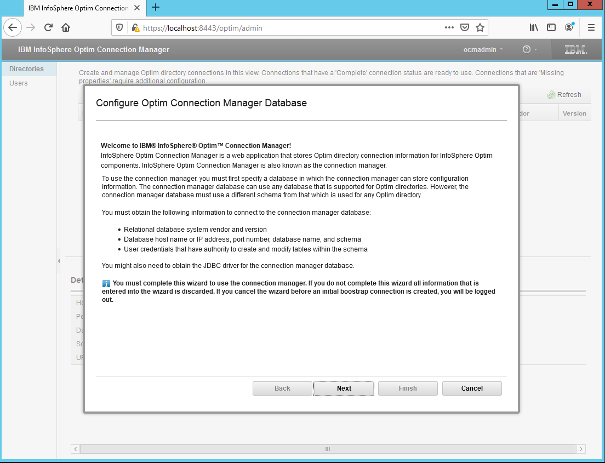

Информация о соединениях сохраняется Optim Connection Manager в базе
данных. Необходимо выбрать используемый тип и версию СУБД из списка
поддерживаемых.

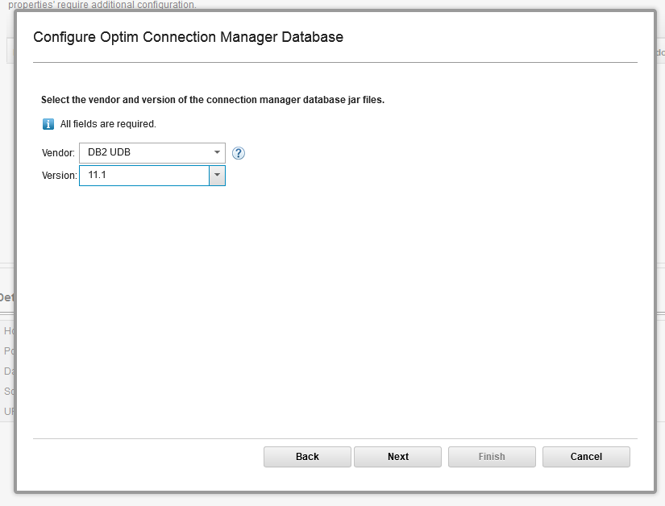

В следующем окне необходимо указать параметры соединения с базой
данных, логин и пароль. Дополнительно необходимо загрузить
JDBC-драйвер для доступа к выбранной СУБД. В данном случае можно
использовать файл драйвера, поставляемый с СУБД Db2 в виде файла
`db2jcc4.jar` и размещённый в каталоге `C:\IBM\SQLLIB\java`.

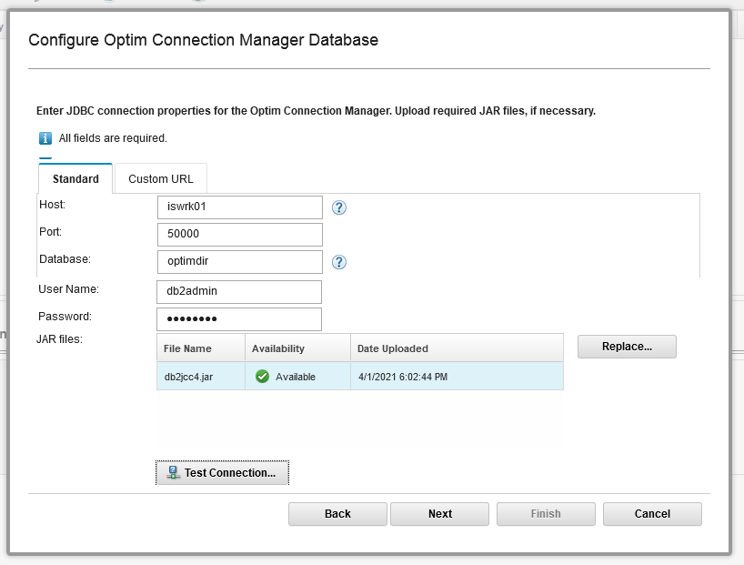

Для размещения таблиц Optim Connection Manager мы будем использовать
созданную на шаге 1 схему `OCM` в базе данных `OPTIMDIR`.

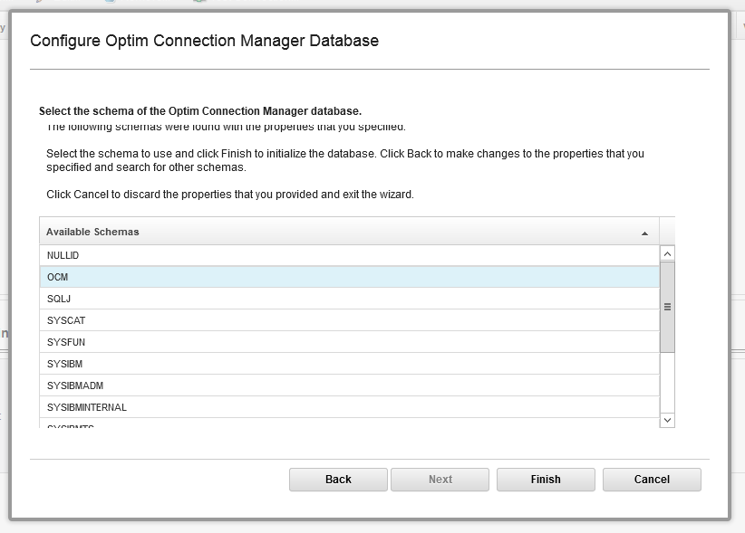

После завершения инициализации Optim Connection Manager необходимо
зарегистрировать в нём ранее созданный репозиторий Optim. В
организации может использоваться произвольное количество репозиториев
Optim (например, отдельно для разработки и эксплуатации, а также с
делением по группам проектов), и Optim Connection Manager
предоставляет единую точку доступа к перечню репозиториев Optim.

Настройка подключения к репозиторию Optim начинается с указания типа и
версии используемой СУБД.

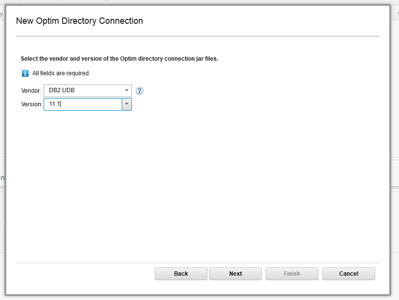

Необходимо указать параметры соединения с базой данных, логин и
пароль. Нежелательно указывать имя сервера в виде локального адреса
(`localhost`, `127.0.0.1`), так как Optim Connection Manager
предоставляет данные о соединениях другим компонентам, исполняемым на
удалённых серверах.

Загрузка JDBC-драйвера не требуется, так как драйвер для Db2 уже был
загружен.

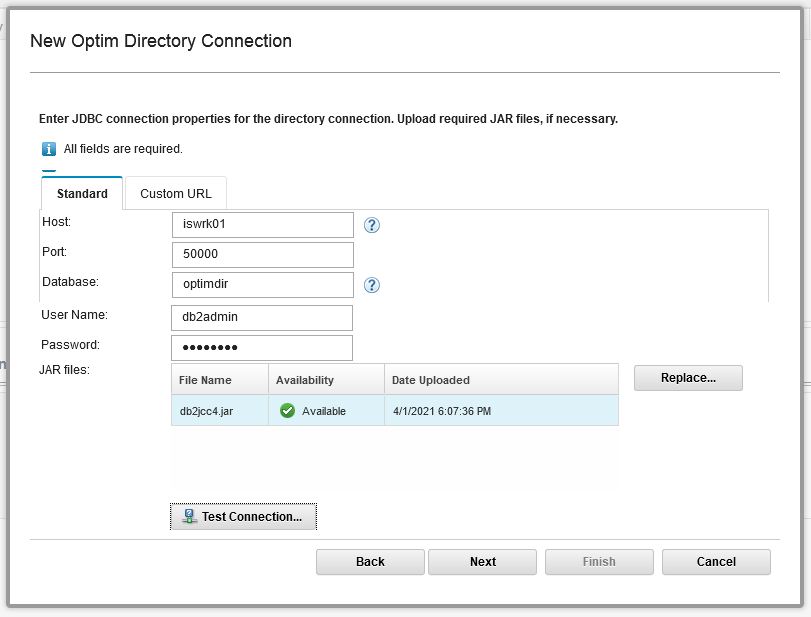

Одна база данных может содержать несколько репозиториев Optim.
В нашем случае существует только один репозиторий.

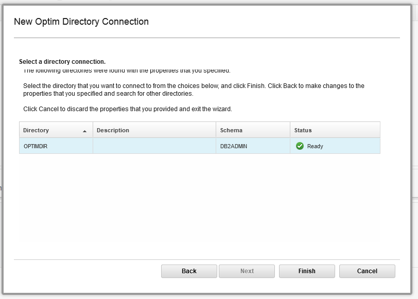

На этом настройка Optim Connection Manager завершена.

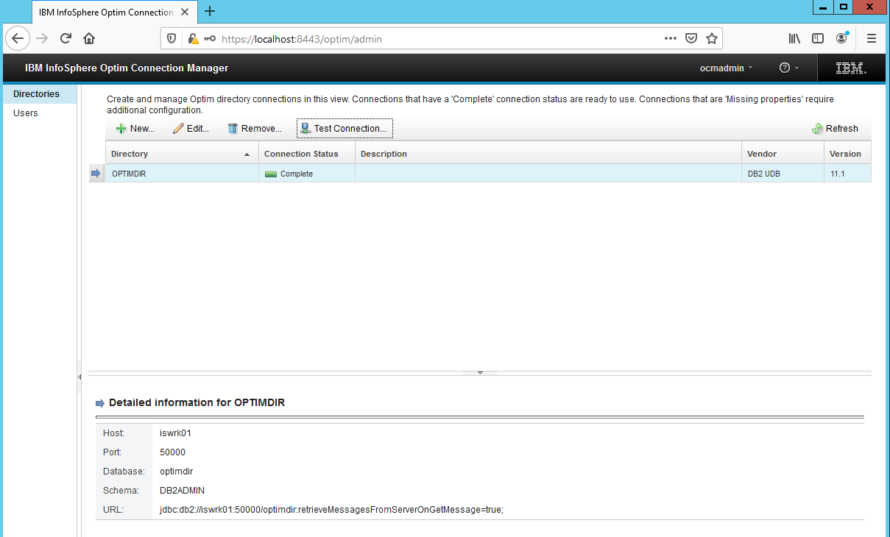

## Optim Designer

После установки актуальных обновлений iFix к Optim Designer необходимо
заменить файл `eclipse.ini` на рекомендованный вариант, поставляемый в
файле `eclipse.OPDM-11.03.00.08-010.ini`. Файл `eclipse.ini` находится
в каталоге `C:\IBM\InfoSphere\Optim\designer`. Ниже приведены команды
по резервному копированию файла и замене его на рекомендованный
вариант.  Для выполнения указанных операций требуется запуск
командного процессора `cmd.exe` с правами администратора.

```text
C:\Windows\system32>cd C:\IBM\InfoSphere\Optim\designer

C:\IBM\InfoSphere\Optim\designer>copy eclipse.ini eclipse.ini.original
Скопировано файлов:         1.

C:\IBM\InfoSphere\Optim\designer>copy eclipse.OPDM-11.03.00.08-010.ini eclipse.ini
Заменить eclipse.ini [Yes (да)/No (нет)/All (все)]: Y
Скопировано файлов:         1.

C:\IBM\InfoSphere\Optim\designer>
```

Запуск Optim Designer производится с помощью ярлыка на рабочем столе
либо в меню "Пуск". Внешний вид Optim Designer до выполнения настройки
подключения к Optim Connection Manager приведён на снимке экрана ниже.

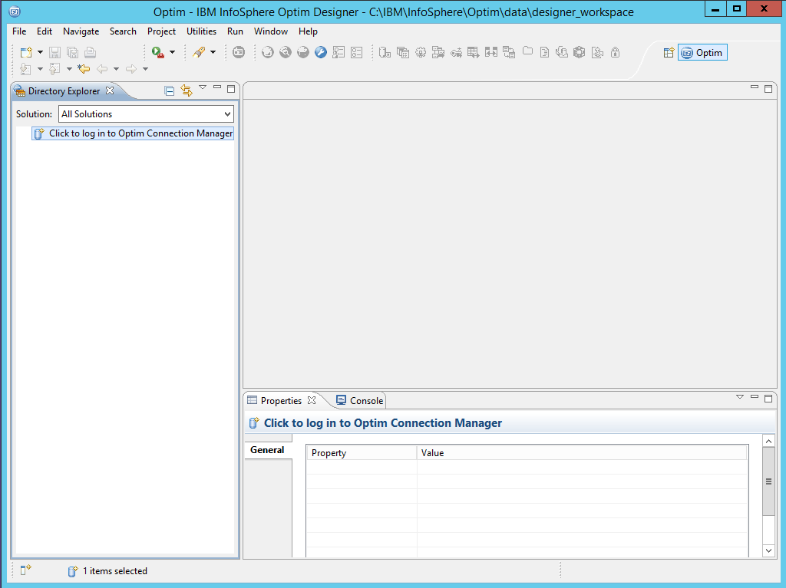

Для подключения к Optim Connection Manager необходимо шёлкнуть "мышью"
в надпись "Click to log in...", и ввести параметры подключения.  Для
доступа может использоваться преднастроенная учётная запись `admin` с
паролем `admin`, редактирование учётных записей осуществляется в
Web-интерфейсе Optim Connection Manager.

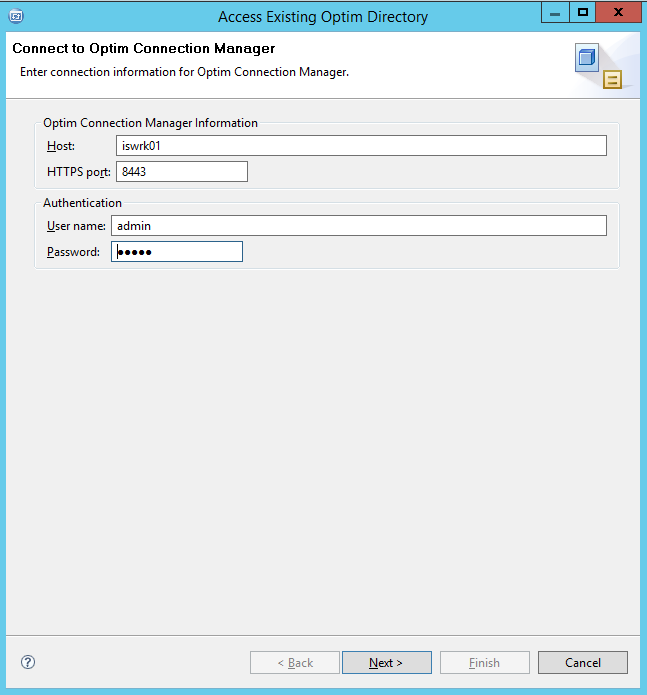

Строку подключения для базы данных репозитория Optim необходимо
установить в локальный псевдоним соединения с соответствующей базой
данных. В нашем случае база данных `optimdir` размещена локально, и её
имя можно непосредственно указать в качестве строки соединения.

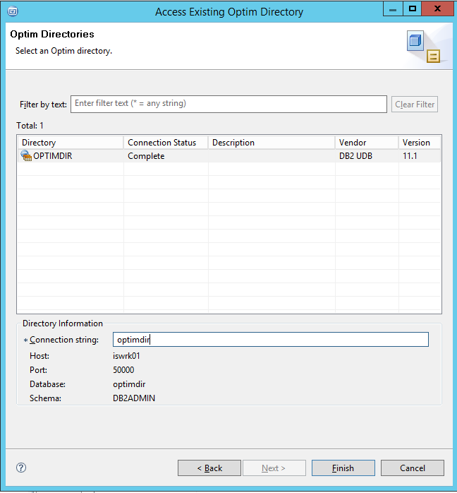

Optim Designer готов к использованию, и может применяться для
настройки подключений к источникам данных, а также процессов выгрузки,
загрузки и маскирования данных.

[Оглавление статьи](OptimInstallSingleHost),
[Предыдущий этап](OptimWebConfig),
[Следующий этап](OptimIisInstall).
