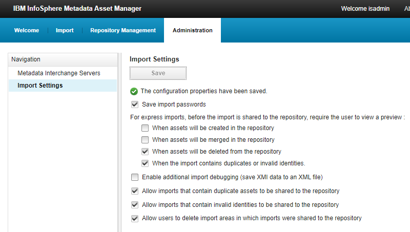
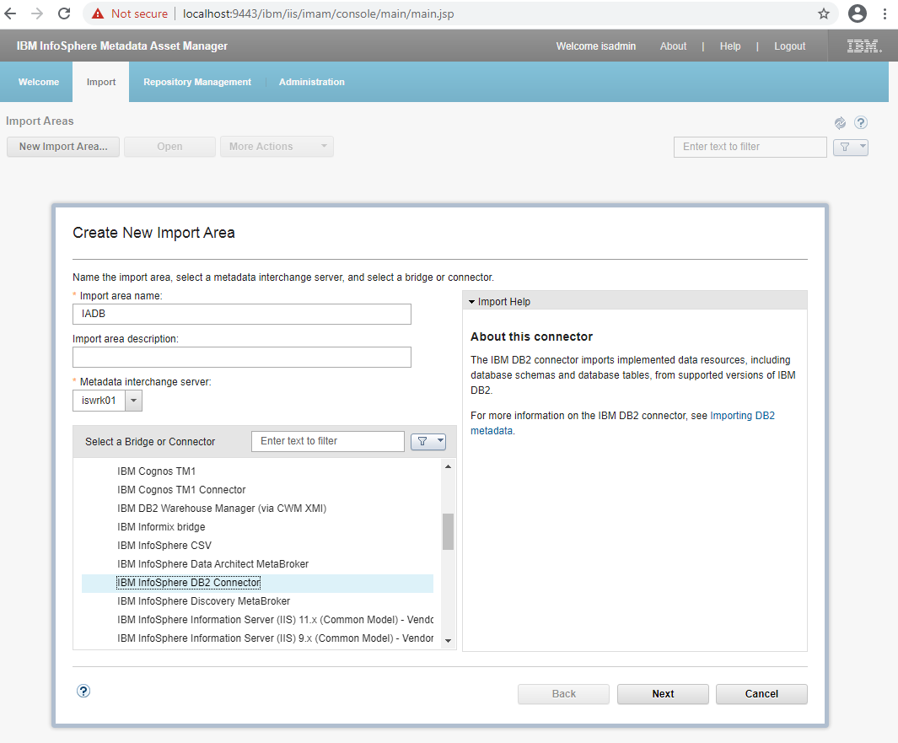

# Настройка IBM Information Server для работы с IBM Optim

Предыдущий этап:
[установка обновлений Information Server](OptimIisUpdate).

Выполняется:
1. Отключение автоматического запуска DataStage Flow Designer
1. Подключение к репозиторию Information Analyzer
1. Первичная настройка Information Analyzer
1. Настройка рекомендуемых параметров Information Analyzer

Дополнительные файлы дистрибутивов не требуются.

----

## 1. Отключение автоматического запуска DataStage Flow Designer

Компонент DataStage Flow Designer автоматически устанавливается при
установке Information Server, при этом он не требуется для работы с
инструментами Information Analyzer и Information Governance Catalog.

Запуск DataStage Flow Designer на платформе Microsoft Windows по
умолчанию производится при входе пользователя в систему.

Для отключения запуска необходимо удалить ключ реестра
`IBM_DataStage_Flow_Designer`, находящийся в ветке
`HKEY_LOCAL_MACHINE\SOFTWARE\Wow6432Node\Microsoft\Windows\CurrentVersion\Run`.

При необходимости запуск DataStage Flow Designer может быть выполнен вручную
с помощью скрипта `startCognitiveDesignerServer.bat`, находящегося в подкаталоге
`ASBNode\CognitiveDesignerEngine` каталога установки Information Server
(по умолчанию `C:\IBM\InformationServer`),

## 2. Подключение к репозиторию Information Analyzer

Выполняется в инструменте Metadata Asset Manager, доступного через Web-интерфейс.
Необходимо открыть стартовую панель инструментов Information Server
(доступную по адресу <https://localhost:9443/ibm/iis/launchpad/>).

Необходимо выбрать пункт "Import" / "New Import Area", ввести название
области IADB, и выбрать тип коннектора (в данном случае - IBM Db2).

