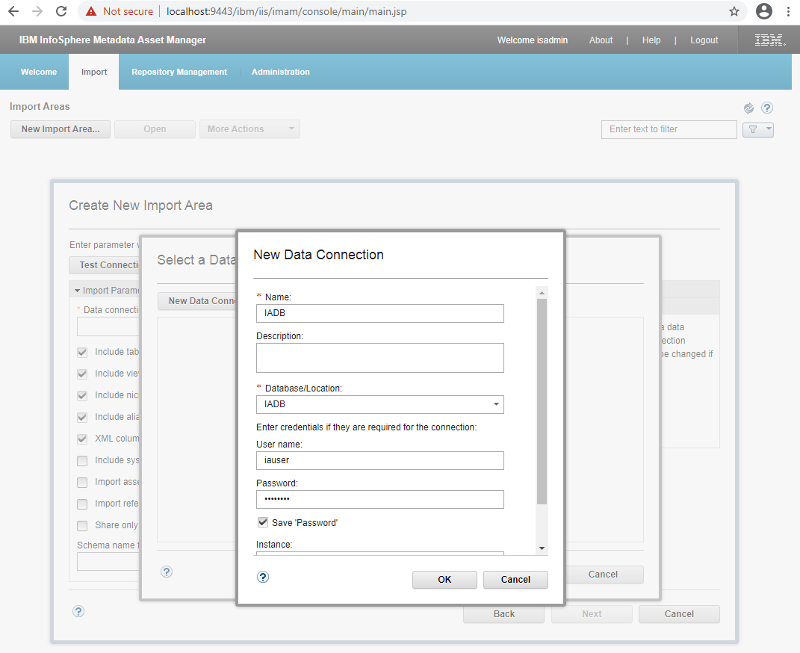
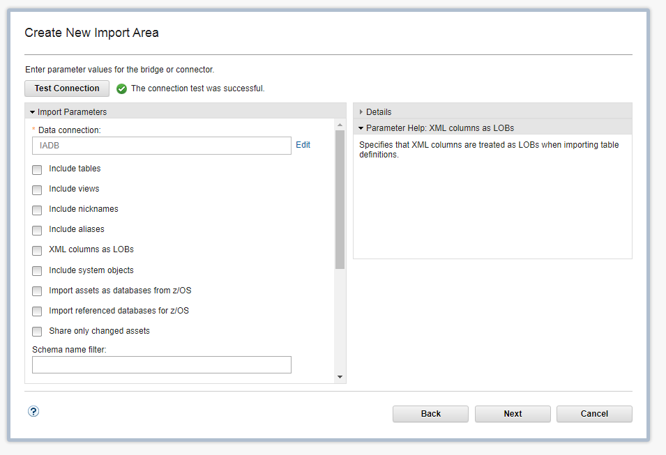
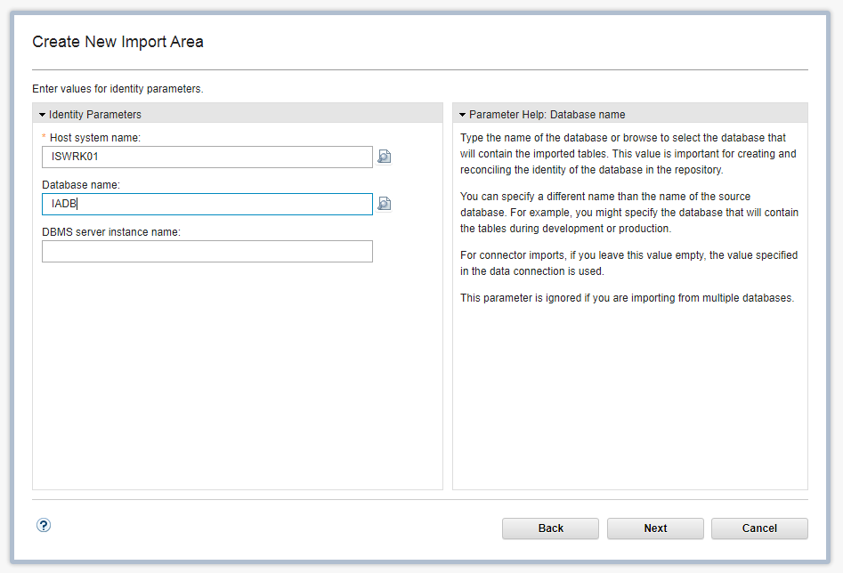
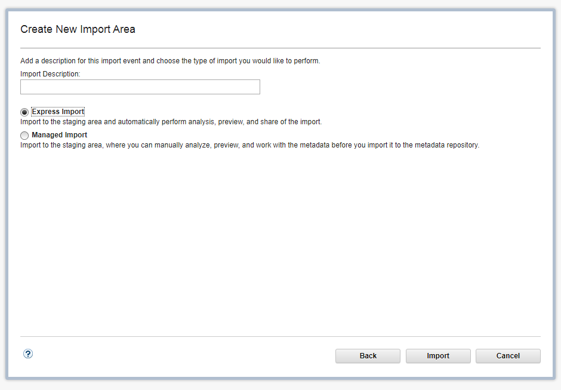
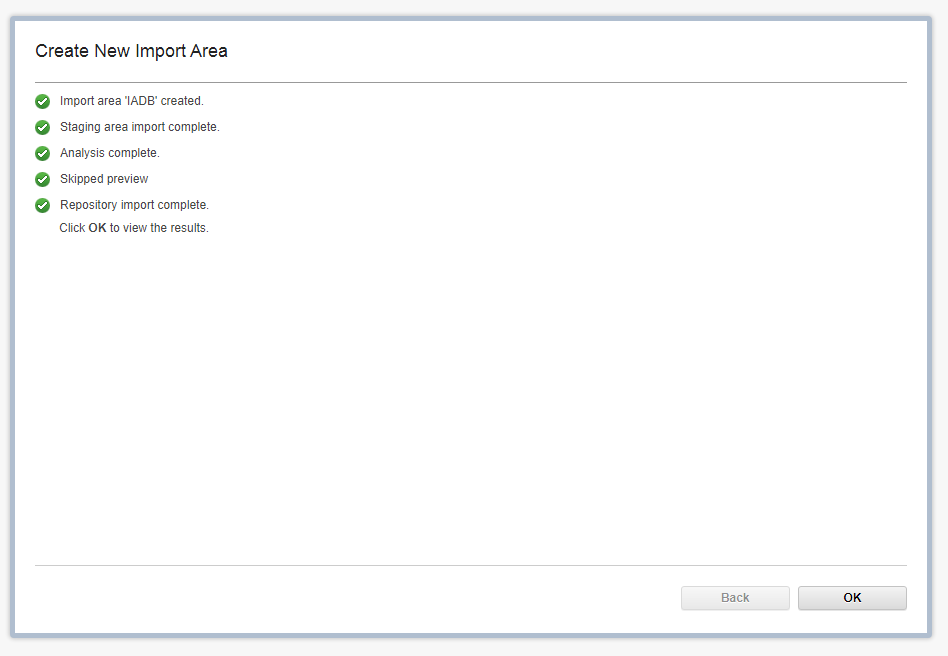

# Настройка IBM Information Server для работы с IBM Optim

[Оглавление статьи](OptimInstallSingleHost),
[Предыдущий этап](OptimIisUpdate),
[Следующий этап](OptimIisClasses).

Выполняется:
1. Отключение автоматического запуска DataStage Flow Designer
1. Подключение к репозиторию Information Analyzer
1. Первичная настройка Information Analyzer
1. Настройка рекомендуемых параметров Information Analyzer

Дополнительные файлы дистрибутивов не требуются.

----

## 1. Отключение автоматического запуска DataStage Flow Designer

Компонент DataStage Flow Designer автоматически устанавливается при
установке Information Server, при этом он не требуется для работы с
инструментами Information Analyzer и Information Governance Catalog.

Запуск DataStage Flow Designer на платформе Microsoft Windows по
умолчанию производится при входе пользователя в систему.

Для отключения запуска необходимо удалить ключ реестра
`IBM_DataStage_Flow_Designer`, находящийся в ветке
`HKEY_LOCAL_MACHINE\SOFTWARE\Wow6432Node\Microsoft\Windows\CurrentVersion\Run`.

При необходимости запуск DataStage Flow Designer может быть выполнен вручную
с помощью скрипта `startCognitiveDesignerServer.bat`, находящегося в подкаталоге
`ASBNode\CognitiveDesignerEngine` каталога установки Information Server
(по умолчанию `C:\IBM\InformationServer`).

## 2. Подключение к репозиторию Information Analyzer

Выполняется в инструменте Metadata Asset Manager, доступного через Web-интерфейс.
Необходимо открыть стартовую панель инструментов Information Server
(доступную по адресу <https://localhost:9443/ibm/iis/launchpad/>).

В разделе "Administration" необходимо включить опцию "Allow users to
delete import areas...", и нажать кнопку "Save".

Далее необходимо выбрать пункт "Import" / "New Import Area", ввести
название области (например, "IADB"), и выбрать тип коннектора (в
данном случае - IBM Db2).

При настройке подключения следует ввести логическое имя подключения
(например, IADB), имя базы данных (IADB), а также имя пользователя и
пароль для подключения (должен использоваться пользователь `iauser`,
созданный при установке).

Для базы данных IADB не требуется импортировать структуру таблиц,
представлений или других объектов БД - все соответствующие флаги
в диалоге настройки следует отключить.

В качестве имени хоста используем имя сервера, на котором выполняется
установка. Имя базы данных - IADB.

Используется режим экспресс-импорта, с немедленной публикацией
результатов импорта в репозитории метаданных.

После завершения импорта должно быть отображено окно с подтверждением
успешного выполнения операции.

[Оглавление статьи](OptimInstallSingleHost),
[Предыдущий этап](OptimIisUpdate),
[Следующий этап](OptimIisClasses).
