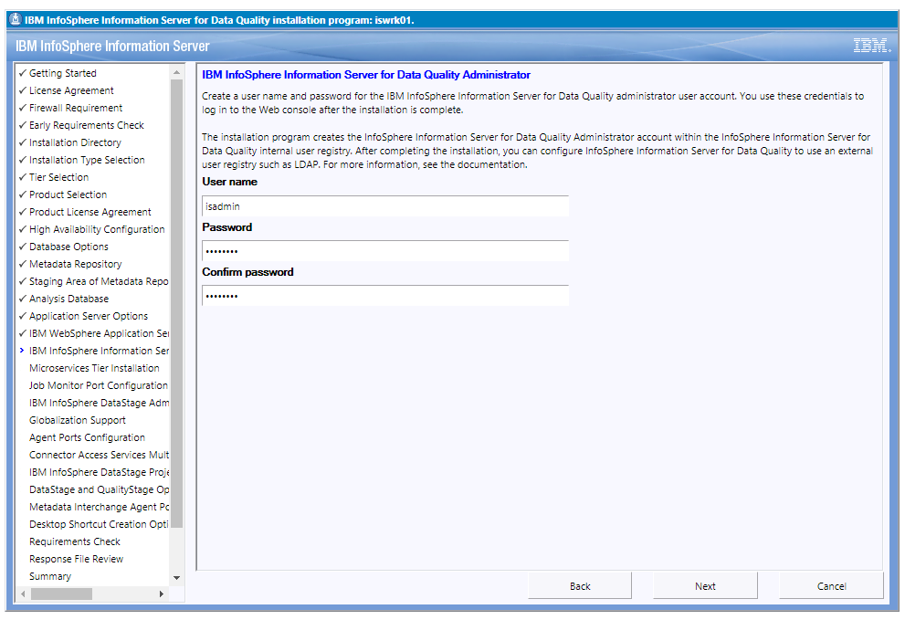

# Установка IBM Information Server из дистрибутива

Выполняется:
1. Подготовка к установке IBM Information Server.
1. Распаковка основного дистрибутива и лицензионного ключа.
1. Запуск инсталлятора и настройка параметров установки.
1. Запуск и ожидание завершения процесса установки.

Необходимые файлы дистрибутивов:
* `IS_V11711_Windows_multi.zip`, либо комплект файлов составного архива
  `IS_V11711_Windows_multi.zip.{001-010}` - полный (клиентский и серверный)
  дистрибутив Information Server для платформы Microsoft Windows;
* `IS_V11711_DQ_and_G_bundle_spec.zip`, либо аналог (в зависимости от
  варианта поставки) - лицензионный ключ Information Server,
  разрешающий установку компонентов Governance Catalog и
  Information Analyzer.

В дополнение к этой инструкции можно использовать описание процесса
установки IBM Information Server (в расширенной, по сравнению с
необходимой для работы совместно с IBM Optim, конфигурации) которые
представлены [на сайте поддержки
IBM](https://www.ibm.com/support/pages/instructions-suite-install-ibm-infosphere-information-server-11710-or-11711-without-microservices-tier).

---

## 1. Подготовка к установке

В рамках подготовки к установке необходимо обеспечить соблюдение
системных требований, изложенных в
[документации](https://www.ibm.com/docs/en/iis/11.7?topic=checklists-basic-installation-checklist>).

Для систем на базе операционной системы Microsoft Windows чаще всего
требуются следующие операции по настройке:
* Обеспечить поддерживаемую конфигурацию сети. Сервер должен иметь
  статический IP-адрес, полное и краткое имя сервера должно
  разрешаться в IP-адрес.
* [Отключить функцию
  UAC](https://www.ibm.com/support/pages/information-server-disabling-uac-windows-server-2012),
  операция выполняется путём установки в значение `0` параметра
  реестра `EnableLUA` в ветке
  `HKEY_LOCAL_MACHINE\SOFTWARE\Microsoft\Windows\CurrentVersion\policies\system`.

Дополнительно необходимо обеспечить, чтобы группа локальных
администраторов называлась `Administrators` (см. снимок экрана
ниже). Это временное ограничение текущей версии IBM Information
Server.

Проверка соблюдения всех требований может быть выполнена с помощью
инструмента [ISALite](https://www.ibm.com/support/pages/node/576889),
доступного для свободной загрузки.

Программа установки IBM Information Server также проверяет соблюдение
системных требований.

## 2. Распаковка основного дистрибутива и лицензионного ключа

Необходимо распаковать основной дистрибутив из поставляемого ZIP-архива.
Рекомендуется использовать программу 7zip, либо встроенную операцию
"Распаковать всё" Проводника Microsoft Windows. Многотомный вариант
архива может быть распакован только программой 7zip.

Архив с лицензионным ключом необходимо распаковать таким образом,
чтобы файлы, входящие в состав архива, были помещены в каталог
`is-suite`, создаваемый при распаковке основного дистрибутива.
См. ниже снимок экрана с примером настроек распаковки лицензионного
ключа с помощью программы 7zip.

## 3. Запуск инсталлятора и настройка параметров установки

Для начала установки необходимо запустить с правами администратора
программу `setup.exe`, размещённую в каталоге `is-suite`, созданном
при распаковке основного дистрибутива.

После инициализации инсталлятор автоматически запустит Web-браузер, в
котором будут отображаться опции настройки, а также прогресс процесса
установки. Сетевой адрес для указания в адресной строке браузера
инсталлятор выводит в собстенном консольном окне, обычно используется
значение `https://<Имя Сервера>:8444/`. Для корректного отображения
интерфейса инсталлятора рекомендуется использовать актуальную версию
браузера Google Chrome.

Большинство опций инсталлятора можно оставить установленными в
значения по умолчанию.

При выборе состава устанавливаемых уровней (Tier Selection) необходимо
выбрать все четыре опции (Repository, Services, Engine, Client).

При выборе состава устанавливаемых продуктов необходимо указать:
* Information Analyzer;
* Information Governance Catalog;
* Metadata interchange agent and bridges.

Кластерная конфигурация не требуется для функционирования
Information Server, при установке минимально необходимой
для работы IBM Optim системы она не используется.

Поскольку база данных Db2 для развёртывания репозитория уже была
установлена, выбираем опцию "Create the repository in an existing DB2
instance on this computer."

В запросах ввода паролей создаваемых технических учётных записей
необходимо вводить пароли, соответствующие действующей парольной
политике. Имена и пароли создаваемых технических учётных записей
необходимо записать для последующего использования. Обязательно
следует сохранить пароли следующих учётных записей:
* `isadmin` - администратор сервисов Information Server;
* `dsadm` - учётная запись управления пакетным выполнением заданий;
* `iauser` - учётная запись управления Information Analyzer.

При выборе типа сервера приложений при построении среды для целей
демонстрации и тестирования функций рекомендуется выбрать наиболее
легковесный вариант - WebSphere Liberty Core.

Необходимо ввести и запомнить либо записать пароль администратора
сервисов Information Server.

В минимальной конфигурации установка уровня микросервисов
(Microservices Tier) не производится.

На всех последующих шагах мастера настройки используются значения
по умолчанию, за исключением паролей создаваемых пользователей,
которые необходимо ввести в соответствующие поля.

После проверки выполнения системных требований и подтверждения
установки будет проведена инсталляция выбранных компонентов.

После завершения установки рекомендуется выполнить перезагрузку
сервера.

Следующий этап - [установка обновлений Information Server](OptimIisUpdate).
