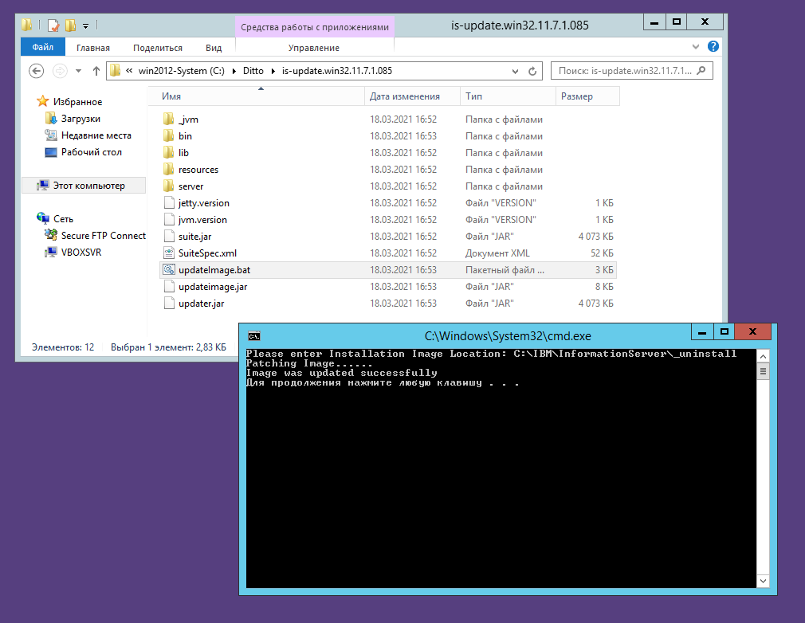
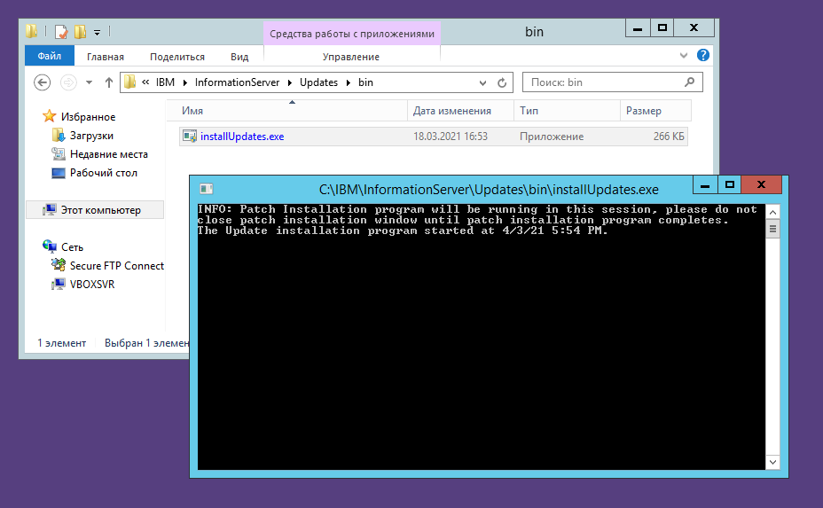
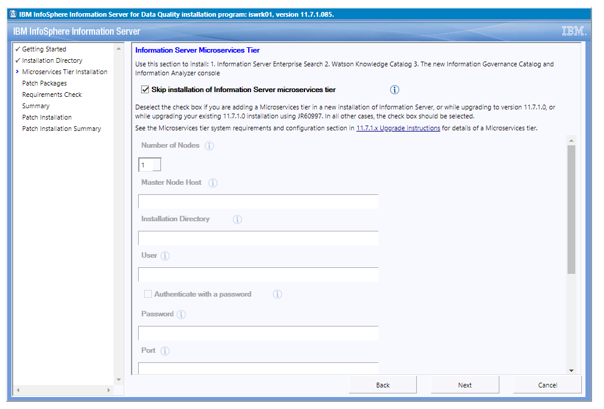
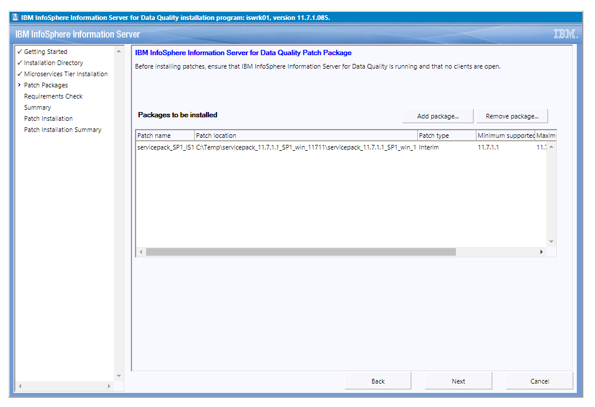
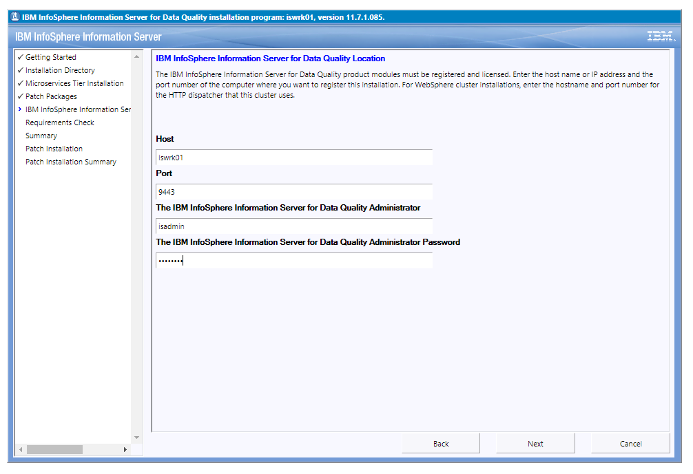
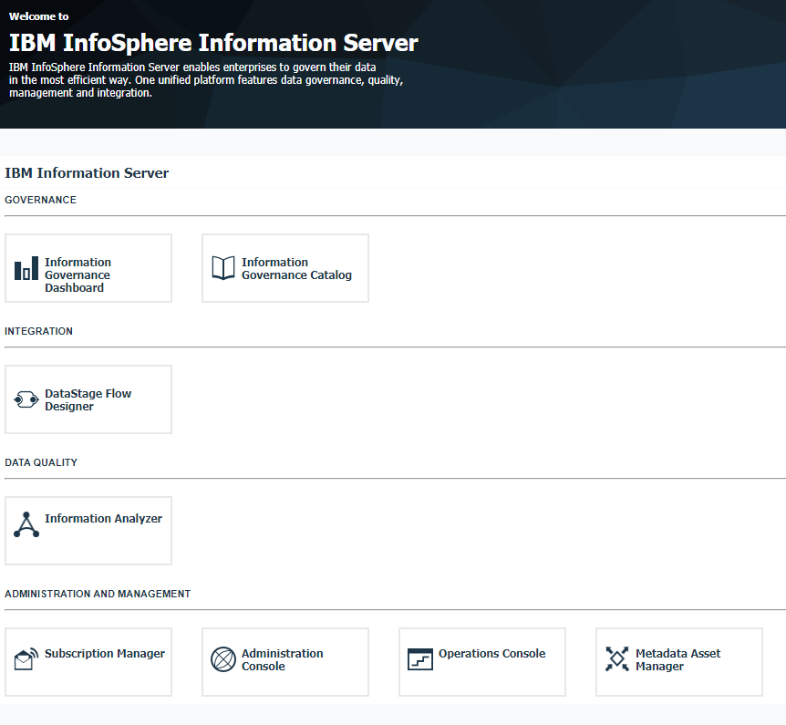

# Применение обновлений IBM Information Server

Выполняется:
1. Обновление программы установки обновлений.
1. Применение обновлений.

Необходимые файлы дистрибутивов:
* `is-update.win32.11.7.1.085.zip` - актуальная версия программы
  установки обновлений Information Server для платформы Microsoft
  Windows;
* `servicepack_11.7.1.1_SP1_win_11711.zip` - пакет обновления Service
  Pack 1 для IBM Information Server версии 11.7.1.1, для платформы
  Microsoft Windows.

В дополнение к этой инструкции можно использовать описание процесса
обновления IBM Information Server (в расширенной, по сравнению с
необходимой для работы совместно с IBM Optim, конфигурации) которые
представлены на сайте поддержки IBM:
* [общая инструкция](https://www.ibm.com/support/pages/system/files/inline-files/installing_fixes_fixpacks_updates117_0.html);
* [инструкция к версии 11.7.1.1](https://www.ibm.com/support/pages/node/6128295).

---

## 1. Обновление программы установки обновлений Information Server

Установка обновлений IBM Information Server должна выполняться
актуальной версией программы установки обновлений.

Для обновления версии программы установки обновлений необходимо:
1. распаковать дистрибутив программы установки обновлений из архива;
1. запустить скрипт `updateImage.bat` с правами администратора;
1. ввести в окне выполнения скрипта полный путь к подкаталогу
`_uninstall` каталога установки Information Server, и нажать ENTER;
1. дождаться установки обновлённой версии программы.

См. также снимок экрана ниже.

## 2. Применение обновлений Information Server

Перед установкой обновлений Information Server необходимо выполнить
распаковку устанавливаемого обновления в выбранный каталог на
сервере Information Server.

Затем требуется запустить программу установки обновлений, запустив
файл `Updates\bin\installUpdates.exe` (размещённый в каталоге
установки Information Server) с правами администратора, как показано
на снимке экрана ниже.

Установку уровня микросервисов (Microservices Tier) необходимо
пропустить, поскольку они не требуются в минимальной системе.

Устанавливаемые обновления (файлы пакетов `*.ispkg`) следует выбрать
для установки в диалоге "Patch Packages".

Для установки обновления необходимо ввести логин и пароль
администратора сервисов Information Server.

По завершении процесса установки обновлений будет отображена страница
панели инструментов Information Server, доступная на сервере
Information Server по ссылке
<https://localhost:9443/ibm/iis/launchpad/>.

Следующий этап - [настройка Information Server](OptimIisConfig).
