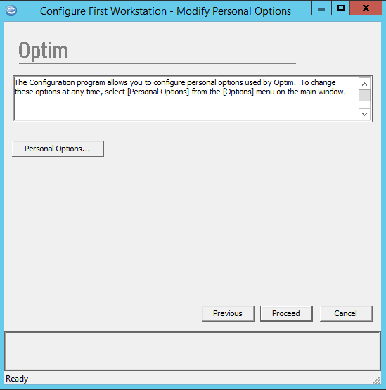

# Базовая настройка IBM Optim после установки

[Оглавление статьи](OptimInstallSingleHost),
[Предыдущий этап](OptimOptimInstall),
[Следующий этап](OptimWebConfig).

## 3.1 Конфигурирование ядра Optim

Для конфигурирования ядра Optim выполняется запуск конфигурационной
программы "Optim Configuration" с помощью ярлыка на рабочем столе либо
в меню "Пуск".

В меню конфигурационной программы Optim выбираем пункт "Tasks" /
"Configure the First Workstation".

Вводим имя заказчика, стандартное значение для демонстрационных
систем - "Optim Customer".

Выбираем режим работы - создание нового репозитория Optim. Имя
репозитория оставляем указанным по умолчанию - `OPTIMDIR`.

Выбираем тип и версию СУБД, в нашем случае используется Db2 11.1.

В поле строки подключения вводим имя созданной на шаге 1 базы данных
репозитория Optim, `optimdir`. В качестве логина вводим техническую
учётную запись администратора Db2 - `db2admin`, и соответствующий ей
пароль.

Пропускаем информацию по использованию функции Unicode для источников
данных Db2.

Для размещения таблиц используем табличное пространство по умолчанию,
а именно `USERSPACE1`.

Подтверждаем создание программных объектов для доступа к таблицам
репозитория со стороны компонентов Optim.

Подтверждаем сохранение логина и пароля для доступа к базе данных
репозитория Optim.

В базе данных репозитория Optim обычно не рекомендуется хранение
других видов информации, поэтому мы не создаём псевдонима
(именованного подключения) для доступа к этой базе данных.

Временно пропускаем создание псевдонимов для доступа к источникам
данных. Подключения к источникам будут настраиваться на шаге 6.

В тестовой системе не предполагается использование расширенных средств
защиты, поэтому инициализация соответствующей функции не выполняется.

Подтверждаем отсутствие установленной опции для доступа к архивным
файлам Optim (входит в состав продукта Optim Archive, требует другого
лицензионного ключа).

Подтверждаем создание нового конфигурационного файла с глобальными
опциями продукта Optim.

Открываем окно настройки опций продукта, нажав на кнопку "Product
Options". В качестве запрашиваемого пароля вводим слово "optim" (без
кавычек, маленькими буквами).

В поле "Maximum Extract Rows" необходимо ввести значение 999999999999.

В разделе "Database" необходимо включить режим "Allow Parallel
Processing" и установить максимальное разрешённое количество сессий с
базой данных.

После установки необходимых опций продукта необходимо подтвердить
изменения и перейти к следующему диалоговому окну - установке
персональных настроек. Для открытия окна редактирования персональных
настроек необходимо нажать кнопку "Personal Options".

Необходимо указать каталоги для хранения временных и
условно-постоянных наборов данных Optim. Рекомендуется создать два
пустых каталога в файловой системе с достаточным объёмом свободного
пространства. Эти настройки можно поменять в любой момент в будущем.

Для оптимизации производительности в разделе "Database" рекомендуется
указать максимально доступный уровень параллелизма доступа к базам
данных. Соответствующий параметр ограничен ранее выполненной
настройкой глобальных параметров продукта.

Пропускаем операцию экспорта записей реестра для переноса на другие
рабочие станции (её при необходимости можно выполнить позднее).

На этом первоначальное конфигурирование ядра Optim завершено.

[Оглавление статьи](OptimInstallSingleHost),
[Предыдущий этап](OptimOptimInstall),
[Следующий этап](OptimWebConfig).
