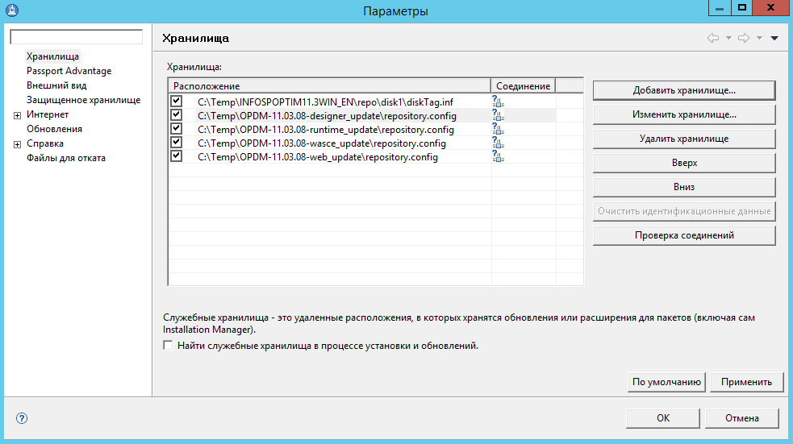
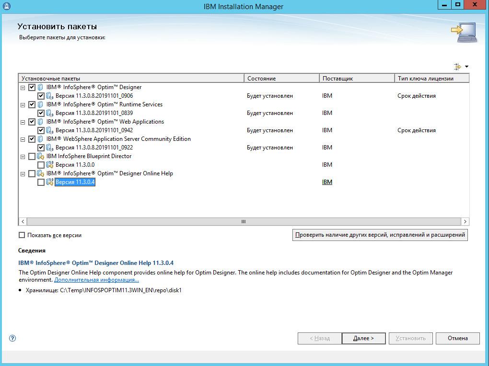
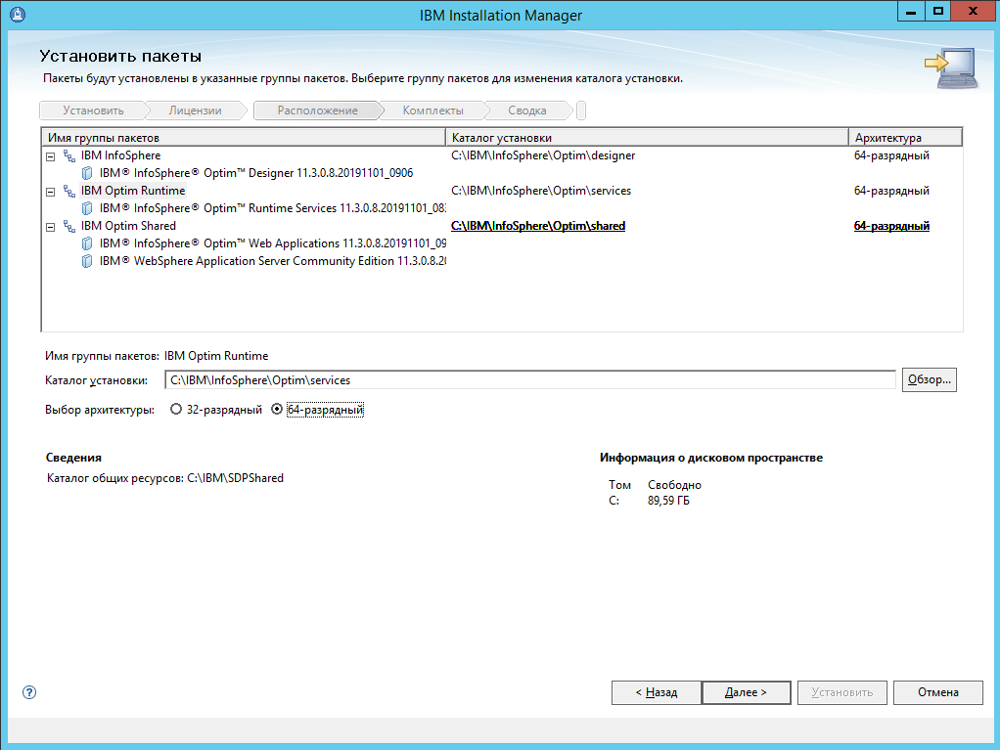
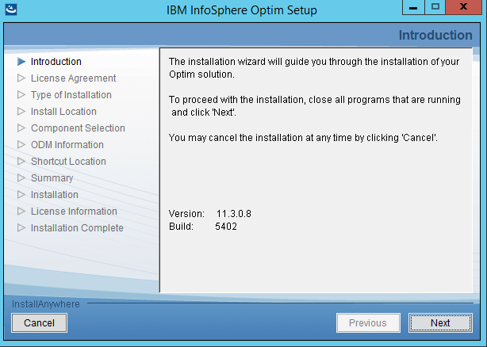
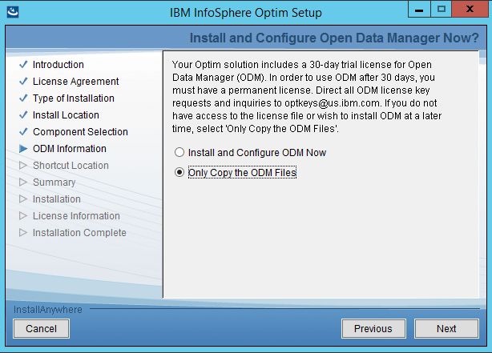
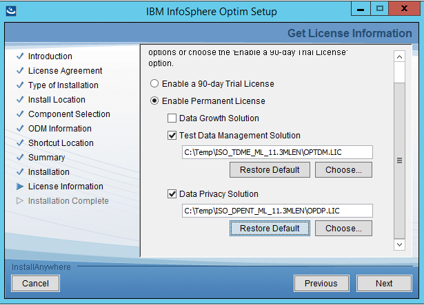
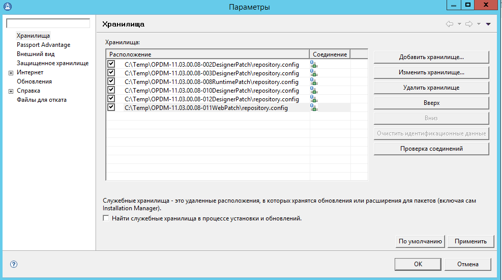
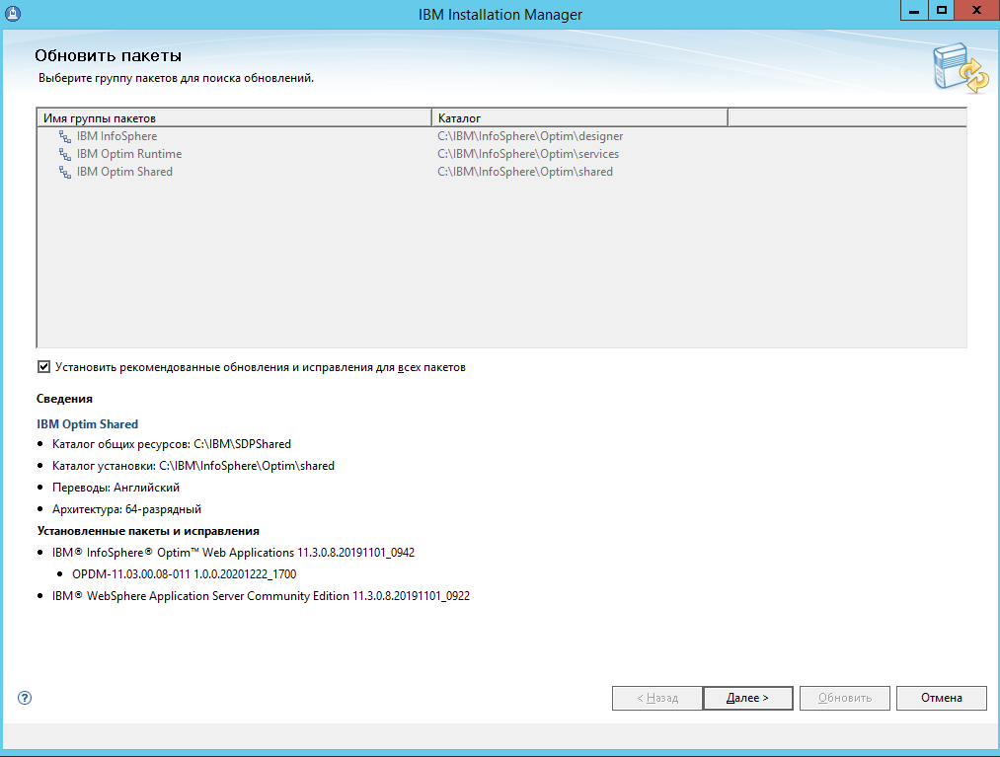
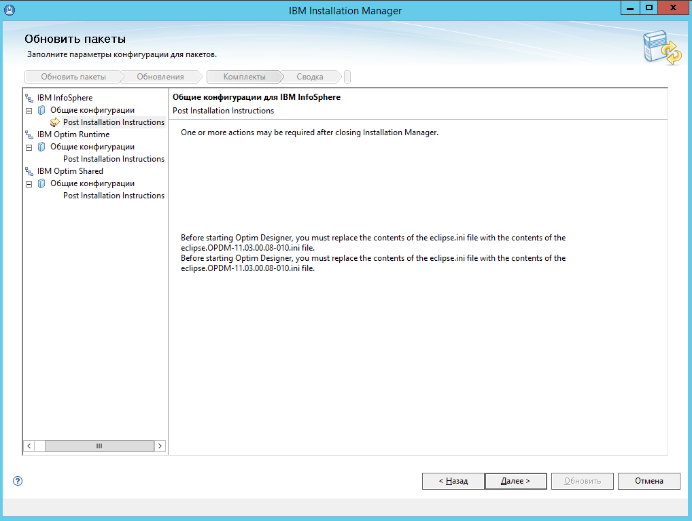
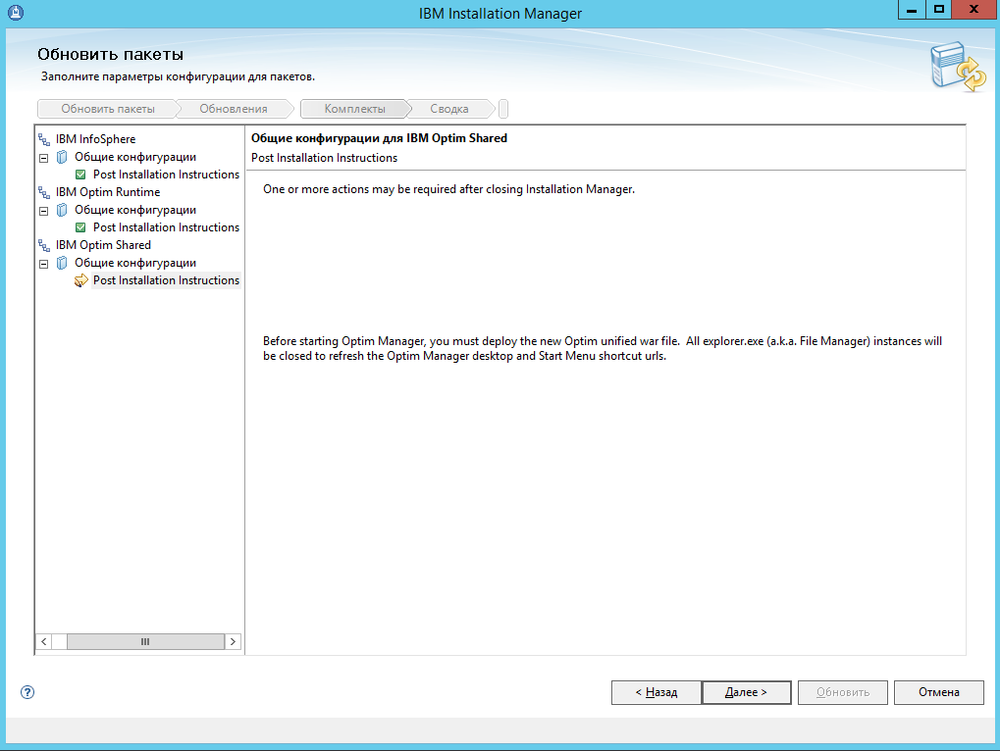

# Установка программного обеспечения IBM Optim

[Оглавление статьи](OptimInstallSingleHost),
[Предыдущий этап](OptimDb2Install),
[Следующий этап](OptimInitialConfig).

Выполняется:

1. Установка программы IBM Installation Manager
1. Распаковка основного дистрибутива IBM Optim и файлов обновлений
   к нему.
1. Запуск IBM Installation Manager и его настройка для использования
   необходимого комплекта дистристрибутивов.
1. Установка программного обеспечения IBM Optim средствами IBM
   Installation Manager и программы установки Optim.
1. Установка пакетов обновления iFix для программного обеспечения
   IBM Optim.

Необходимые файлы дистрибутивов:

* `agent.installer.win32.win32.x86_64_1.9.1005.20210309_1755.zip` -
  дистрибутив программы IBM Installation Manager;
* `INFOSPOPTIM11.3WIN_EN.zip` - основной дистрибутив IBM Optim
  версии 11.3 Fix Pack 4;
* `OPDM-11.03.08-runtime_update.zip` - обновление 11.3 Fix Pack 8
  для компонента Optim Designer;
* `OPDM-11.03.08-designer_update.zip` - обновление 11.3 Fix Pack 8
  для компонента Optim Designer;
* `OPDM-11.03.08-wasce_update.zip` - обновление 11.3 Fix Pack 8
  для компонента IBM WAS CE;
* `OPDM-11.03.08-web_update.zip` - обновление 11.3 Fix Pack 8
  для Web-модулей IBM Optim.

Лицензионные ключи:

* `ISO_DPENT_ML_11.3MLEN.zip` - лицензионный ключ для активации
  функции маскирования;
* `ISO_TDME_ML_11.3MLEN.zip` - лицензионный ключ для активации
  функции формирования подмножеств данных.

Пакеты обновлений iFix (по состоянию на 1 апреля 2021 года):

* `OPDM-11.03.00.08-002DesignerPatch.zip`
* `OPDM-11.03.00.08-003DesignerPatch.zip`
* `OPDM-11.03.00.08-008RuntimePatch.zip`
* `OPDM-11.03.00.08-010DesignerPatch.zip`
* `OPDM-11.03.00.08-012DesignerPatch.zip`
* `OPDM-11.03.00.08-011WebPatch.zip`

---

Для установки IBM Installation Manager необходимо:

1. распаковать его дистрибутивный архив;
1. запустить из каталога с дистрибутивом программу `install.exe`
   с правами администратора;
1. следовать инструкциям мастера по установке.

Далее необходимо распаковать дистрибутив IBM Optim и обновления
к нему в отдельные каталоги, после чего запустить IBM Installation
Manager.

В окне настроек состава источников установки, вызываемом путём
выбора пункта меню "Файл" - "Параметры", необходимо выбрать
исходные хранилища, как показано на снимке экрана ниже.

Необходимо также убедиться в том, что опция "Найти служебные хранилища..."
в нижней части окна настроек выключена.

Далее следует подтвердить изменение настроек, и выбрать опцию
"Установить" в главном окне программы IBM Installation Manager.  В
появившемся окне выбора компонентов необходимо выбрать все
предлагаемые элементы, за исключением:

* модуля "Blueprint Director", который в настоящее
  время не используется;
* модуля "Designer Online Help", который не совместим
  с 64-битным вариантом развёртывания.

Рекомендуется выбрать установку 64-битной версии компонентов Optim,
как показано на снимке экрана ниже:

Для всех остальных опции в диалогах IBM Installation Manager можно
использовать значения по умолчанию.

---

После завершения установки основных компонентов будет автоматически
запущена вспомогательная программа установки IBM Optim, внешний вид
которой показан на на снимке экрана ниже:

Для большинства опций программы установки Optim можно сохранить
значения по умолчанию, за исключением следующих:

* отключить режим настройки пробной версии Open Data Manager (ODM),
  выбрав режим "Only Copy the ODM Files" (см. снимок экрана ниже).

В завершение процесса инсталляции программа установки Optim
запросит лицензионные ключи. Их необходимо извлечь из файлов
`ISO_DPENT_ML_11.3MLEN.zip` и `ISO_TDME_ML_11.3MLEN.zip`,
и указать пути к этим файлам как показано на снимке экрана
ниже.

После завершения копирования программного обеспечения программа
установки Optim предложит запустить программу настройки.
В рамках предлагаемого сценария установки выполнение настройки
Optim происходится после установки пакетов обновлений iFix.
Опцию запуска конфигурационной программы следует выключить,
и подтвердить выход из вспомогательной программы установки
Optim.

---

Вернувшись в интерфейс IBM Installation Manager, необходимо
подтвердить завершение процесса установки, а затем, вернувшись в
главное окно, повторно открыть диалог настройки, и указать состав
источников установки в соответствии с доступным перечнем обновлений
iFix (как показано на снимке экрана ниже). Обновления iFix необходимо
предварительно распаковать, поместив файлы каждого обновления в свой
отдельный каталог файловой системы.

Необходимо убедиться в том, что опция "Найти служебные хранилища..."
в нижней части окна настроек выключена.

Далее следует подтвердить изменение настроек, и выбрать опцию
"Обновить" в главном окне программы IBM Installation Manager.  В
появившемся диалоговом окне необходимо выбрать опцию "Установить
рекомендованные обновления...", как показано на снимке экрана ниже:

Рекомендуется изучить выводимые инструкции по действиям после
установки обновлений, примеры которых приведены ниже:

Дальнейшие действия по установке обновлений iFix сводятся по нажатию
кнопки "Далее" в диалогах IBM Installation Manager.

Распакованные дистрибутивы после завершения установки могут быть
удалены для экономии дискового пространства.

[Оглавление статьи](OptimInstallSingleHost),
[Предыдущий этап](OptimDb2Install),
[Следующий этап](OptimInitialConfig).
