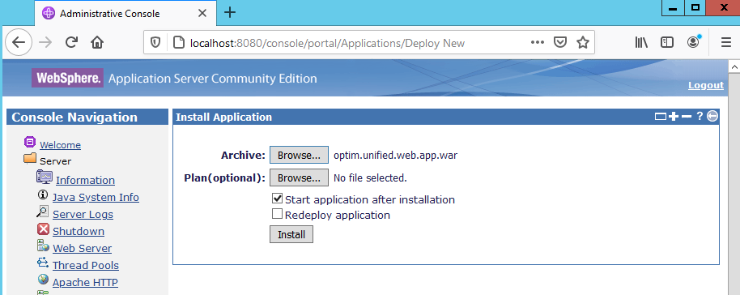

# Первоначальная настройка Web-приложений IBM Optim

Для обеспечения автоматического запуска Web-приложений Optim при
загрузке сервера необходимо настроить поставляемый в комплекте сервер
приложений WAS CE для старта как сервиса Windows.

[Официальная
инструкция](https://www.ibm.com/support/knowledgecenter/SSMLQ4_11.3.0/com.ibm.nex.install.doc/topics/opinstall_enabling_management_server_as_windows_service.html)
по настройке сервиса Web-приложений Optim на английском языке есть в
составе документации IBM Optim.

Для настройки сервиса WAS CE на сервере должен быть установлен Microsoft®
.NET Framework 3.5 или более поздней версии.

Сразу после установки конфигурационные файлы программы управления
сервисами Windows настроены в предположении, что сервер приложений
WAS CE установлен в каталог
`C:\IBM\InfoSphere\Optim\shared\WebSphere\AppServerCommunityEdition`,
что соответствует показанным на шаге 2 примерам настроек.  Если сервер
приложений WAS CE установлен в другой каталог, необходимо
скорректировать пути, заданные в файлах `appServerService.xml` и
`optimService.bat`.

Для настройки запуска сервера приложений WAS CE как сервиса необходимо:
1. открыть командную строку `cmd.exe` с правами администратора
сервера;
1. перейти в подкаталог `bin` каталога установки сервера приложений
WAS CE;
1. выполнить команду `appServerService.exe install`

Пример выполнения соответствующих команд приведён ниже:
```
C:\Users\zinal>cd C:\IBM\InfoSphere\Optim\shared\WebSphere\AppServerCommunityEdition

C:\IBM\InfoSphere\Optim\shared\WebSphere\AppServerCommunityEdition>cd bin

C:\IBM\InfoSphere\Optim\shared\WebSphere\AppServerCommunityEdition\bin>appServerService.exe install

C:\IBM\InfoSphere\Optim\shared\WebSphere\AppServerCommunityEdition\bin>
```

В результате будет создан Windows-сервис `IBM InfoSphere Optim Application Server`:


Первоначальный запуск сервиса может быть выполнен из оснастки Windows
для управления сервисами, либо командой `appServerService.exe start`.

Протоколы работы WAS CE при необходимости можно просмотреть в каталоге
`C:\IBM\InfoSphere\Optim\shared\WebSphere\AppServerCommunityEdition\var\log`.

После запуска сервера приложений WAS CE необходимо открыть консоль
управления сервера приложений. Это можно сделать, введя адрес
`http://hostname:8080/console` в браузере, либо с помощью ярлыка
"WAS-CE Console", который по умолчанию создаётся на рабочем столе.
Первоначально для входа может использоваться логин `system` с паролем
`manager`.

В разделе "Console Navigation" необходимо выбрать раздел "Web App WARs",
выбрать операцию "Uninstall" для приложения, обслуживающего путь "/optim",
и подтвердить операцию удаления.


Далее в разделе "Console Navigation" необходимо выбрать раздел
"Deployer", и выбрать для установки файл `optim.unified.web.app.war`,
находящийся в каталоге `C:\IBM\InfoSphere\Optim\shared\web\app`
(такой путь соответствует настройкам, указанным при установке на шаге 2).



Если для управления операциями Optim планируется использование
[сервисного интерфейса](https://www.ibm.com/support/knowledgecenter/SSMLQ4_11.3.0/com.ibm.nex.interface.doc/topics/opinter_programming_service_interface.html),
необходимо аналогичным образом (через раздел "Deployer") установить
модуль `optim.service.interface.war`, размещённый в каталоге
`C:\IBM\InfoSphere\Optim\shared\osi\app`. Инструкция по установке
сервисного интерфейса также приведена
[в документации](https://www.ibm.com/support/knowledgecenter/SSMLQ4_11.3.0/com.ibm.nex.install.doc/topics/opinstall_deploying_interface.html).

Следующий этап - [настройка Optim Connection Manager и Optim Designer](OptimDesignerConfig).